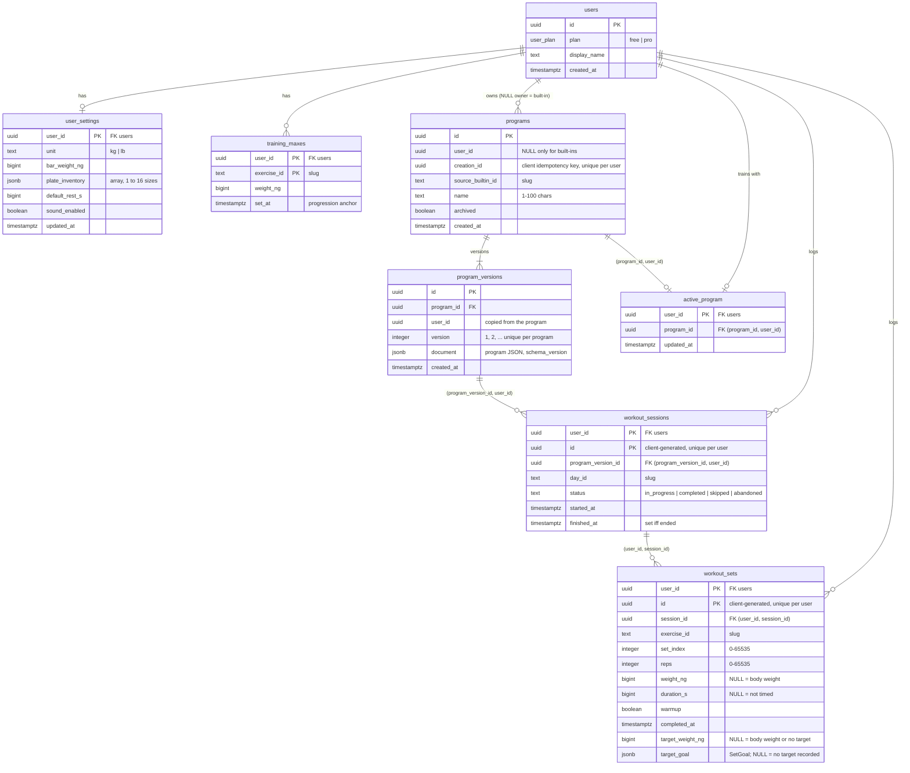

# Database

Postgres 18 (Neon in production, Docker Compose locally). The migrations are in
`crates/iron-oxide-app/migrations/` and run at server startup; the repository layer that reads and
writes them is `crates/iron-oxide-app/src/server/db/`. See the README for running Postgres, adding
migrations and refreshing `.sqlx/`.

**Data isolation is the app's first security property: a user can never read or change another
user's data.** It is enforced twice: by the database schema (so a wrong query cannot break it) and
by a repository API that cannot express an unscoped query.

## Schema



Sign-in tables (`passkeys`, `oauth_identities`, sign-in `sessions`) come with #5 and follow the same
rules. The workout tables are called `workout_sessions` and `workout_sets` so they cannot clash
with the sign-in `sessions` table.

### Tables

| Table | Holds | Notes |
|---|---|---|
| `user_settings` | Unit, bar weight, plate inventory, default rest, sound | One row per user, created by the first save. Until then `settings::find` returns `None` and the API shows `Settings::defaults()` (with the domain's default plate inventory). `UserSettings::defaults()` mirrors the column defaults, which a test keeps equal. |
| `training_maxes` | One training max per user and exercise, with `set_at` | Per user, not per program (#56). A table rather than a jsonb map, so the weight range and the slug are checked. `set_at` is when the lifter entered it: the progression engine (#57) replays the completed sets after it. `training_maxes::set` writes the weight and `set_at` together, but it cannot tell an entered value from a computed one: the caller must pass the time the value is valid from (never keep the old `set_at` with the engine's result), or the same sets are counted twice. |
| `programs` | A program's header | `user_id` is NULL only for built-ins (`CHECK (user_id IS NOT NULL OR source_builtin_id IS NOT NULL)`); one row per built-in id (partial unique index). A copy of a built-in keeps its `source_builtin_id`. `creation_id` is the client's idempotency key for the create or copy request (`UNIQUE (user_id, creation_id)`), so a retry returns the same program. Programs are archived, not deleted: a trigger rejects any `DELETE` that is not the cascade from a deleted user. |
| `program_versions` | Immutable program documents | `version` is 1, 2, ... per program. A trigger rejects every `UPDATE`; there is no update path in the repository. A trigger rejects any `DELETE` that is not the cascade from a deleted user, so a version number is never freed for other content. |
| `active_program` | The program a user trains with | Composite FK to `programs (id, user_id)`: only one of the user's own programs (never a built-in; copy it first). |
| `workout_sessions` | A training session | Client-generated id, primary key `(user_id, id)`. `finished_at` is set exactly when the status is not `in_progress`, and not before `started_at`. |
| `workout_sets` | A logged set | Client-generated id, the idempotency key; primary key `(user_id, id)`. `target_weight_ng` and `target_goal` (#60) are what the app prescribed for the set when it was logged; `target_goal` NULL means no target was recorded (every set logged before #60, extras, added exercises), and such sets keep the legacy judging (exact prescribed weight less 1.25 kg). Not backfilled: the target shown depended on that day's settings and training max. |

### Mapping to the domain types

The repository does not depend on `iron-oxide-domain` yet: the domain types are in open PRs. Its
types mirror them field for field, and switch to them once they are merged.

| Column | Domain type | Storage |
|---|---|---|
| `*_ng` (`bar_weight_ng`, `weight_ng`) | `Weight` (#48) | Exact nanograms, `bigint`, `CHECK` 0 to 2 × 10¹⁵ (2000 kg, `Weight::MAX`); the bar more than 0 (#34). Never floats. |
| `reps`, `set_index` | `Reps` / `u16` (#48, #54) | `integer` with `CHECK` 0 to 65535 (`smallint` is too small for `u16`). |
| `duration_s`, `default_rest_s` | `Seconds` / `u32` (#48) | `bigint` with `CHECK` 0 to 4294967295 (`integer` is too small for `u32`). |
| `exercise_id`, `day_id`, `source_builtin_id` | `ExerciseId`, `DayId`, `BuiltinProgramId` (#48, #56) | `text`, `CHECK (is_slug(...))`: 1 to 64 of `[a-z0-9]` in words split by single hyphens. |
| `workout_sessions.id`, `workout_sets.id` | `SessionId`, `SetId` (#48) | `uuid`, generated on the client (UUIDv7 from the domain constructor, #65). |
| `programs.id`, `program_versions.id`, `users.id` | `ProgramId`, `ProgramVersionId`, `UserId` (#48) | `uuid`, generated by Postgres (`uuidv7()` for programs and versions, #65). |
| `status` | `SessionStatus` (#54) | `text`, `CHECK` in `in_progress`, `completed`, `skipped`, `abandoned` (the domain's serde names). |
| `started_at`, `finished_at`, `completed_at` | The session timestamp `T` (#54) | `timestamptz` (microseconds; the domain uses milliseconds, which fit exactly). |
| `document` | `Program` JSON (#56) | `jsonb`: an object with a numeric `schema_version`, at most 1 MiB. Validated by the domain before it is written. |
| `plate_inventory` | `PlateInventory` JSON (#53) | `jsonb` array of 1 to 16 entries (default: the domain's kg set). Validated by the domain before it is written. Rows saved empty before the rule (#34) were given the default set by `20261003120000_settings_need_a_bar_and_plates`. |

## Isolation strategy

### In the database

1. **Every user-owned table has `user_id uuid NOT NULL REFERENCES users ON DELETE CASCADE`** and an
   index that starts with `user_id`. (`programs` and `program_versions` allow NULL, for built-ins
   only.) Deleting a user deletes all their rows in one statement.
2. **Client-generated ids are unique per user**: `workout_sessions` and `workout_sets` have the
   primary key `(user_id, id)`. Another user's id is exactly like a free one: no error, no
   "taken" signal, and two users may use the same UUID independently. Every unique key of a
   user-owned table includes `user_id`, except a short allowlist of keys over server-generated
   values (`programs`/`program_versions` ids from `uuidv7()`, built-in ids, version
   numbers).
3. **Composite foreign keys that include `user_id`**: a row that points at another user-owned row
   must have the same owner.
   - `workout_sets (user_id, session_id)` → `workout_sessions (user_id, id)`
   - `workout_sessions (program_version_id, user_id)` → `program_versions (id, user_id)`
   - `active_program (program_id, user_id)` → `programs (id, user_id)`
   - `program_versions (program_id, user_id)` → `programs (id, user_id)`

   So a set cannot be attached to another user's session, a session cannot be run from another
   user's (or a built-in's) program version, and another user's program cannot be made active,
   whatever the application sends.
4. **Owners never change**: a trigger rejects any update of `user_id` in every user-owned table.
   Programs and versions cannot be deleted directly either (`forbid_direct_delete`, which lets
   only foreign key cascades through: `pg_trigger_depth() >= 2`), and no table with user data
   (`users` included) can be truncated: `TRUNCATE` skips row triggers, and
   `TRUNCATE ... CASCADE` would empty every user's data at once.
5. **Program versions take their owner from their program**: a trigger sets
   `program_versions.user_id` from `programs.user_id`, ignoring what the caller wrote. This also
   covers built-ins, where the composite key alone would not be checked (a NULL column skips a
   `MATCH SIMPLE` foreign key).
6. **Domain invariants as `CHECK`s**: weight, reps, duration and index ranges, slugs, session
   status, `finished_at` iff ended and not before the start, JSON shapes.

`sessions → program_versions` is `NO ACTION` (checked at the end of the statement), not
`RESTRICT`, so deleting a user can cascade to both tables in one statement.

**Deleting an account** (#22, `account::delete_user`) is that one statement, `DELETE FROM users
WHERE id = $1`, in its own transaction. It is the only path the delete guards let through:
`forbid_direct_delete` passes only cascades (`pg_trigger_depth() >= 2`), and `TRUNCATE` is refused
on every table. No migration or trigger change was needed for it.
`another_users_rows_survive_while_a_deleted_account_leaves_none` reads the tables to check from the
catalog: every table with a `user_id` column, so a future table cannot be forgotten.

### In the repository (`server/db/`)

- **Every function that touches a user's data takes the caller's `UserId`** and filters every
  statement by it (`WHERE ... AND user_id = $user`), including the follow-up reads of idempotent
  writes. Server functions pass the `UserId` from `AuthUser` (#5), never one sent by the client.
  The only unscoped functions are the built-in ones (`programs::seed_builtins`,
  `programs::list_builtins`), which only touch rows without an owner.
- **No existence leak**: a row that does not exist and a row that belongs to someone else give
  the same `RepoError::NotFound`. Foreign key violations (which, with the composite keys, mean
  "not one of yours") also map to `NotFound`. Error messages never include ids, values or
  database error text.
- **Idempotent writes on client ids** (`sessions::start`, `sets::upsert_idempotent`):
  `INSERT ... ON CONFLICT (user_id, id) DO NOTHING`, then, if nothing was inserted, compare with
  the caller's own row (`WHERE id = $id AND user_id = $user`):
  - same id and same content: `Change::Unchanged` (one row, safe under concurrent retries);
  - same id and different content: `RepoError::Conflict`;
  - an id another user also uses: irrelevant, the write is the caller's own and succeeds. The
    other row is never read, compared or modified.
  - A set saved while its session's `start` is committing (the insert's snapshot misses the
    session, the next read sees it) is retried once internally, so it is saved; if the session
    kept changing it returns `RepoError::Transient` ("please try again", nothing saved), never
    `Conflict`.
- **Idempotent program creation** (`programs::create`, `programs::copy_builtin`): the client sends
  a `CreationId` per request. A retry with the same key returns the program it created
  (`Change::Unchanged`), including under concurrent retries; the same key for a different request
  (another document, or a create replayed as a copy) is a `Conflict`. Keys are per user.
  Documents are compared in SQL as `jsonb` (as `add_version` does too), because jsonb normalises
  numbers: `1e16` comes back as `10000000000000000`, which a `serde_json` comparison would
  wrongly treat as a different document.
- **Typed ids** (`UserId`, `ProgramId`, `ProgramVersionId`, `CreationId`, `SessionId`, `SetId`) so ids of
  different kinds cannot be swapped. They will be replaced by the domain ids of #48.
- Queries use the compile-time checked `sqlx::query!` / `query_as!` macros; the metadata is in
  `.sqlx/`.

| Module | Functions |
|---|---|
| `users` | `plan` (the subscription plan, read on every gated call), `lock_plan` (the same with `FOR NO KEY UPDATE`: the serialisation point of quota checks), `unarchived_programs` (what the custom program quota counts); see docs/billing.md |
| `settings` | `find` (`None` when never saved: the API then shows its own defaults, #20), `save` |
| `training_maxes` | `list`, `set`, `delete` |
| `programs` | `seed_builtins`, `list_builtins`, `copy_builtin` and `create` (idempotent on a `CreationId`), `get`, `list`, `rename`, `archive`, `unarchive`, `add_version` (a retried identical upload is a no-op), `list_versions`, `get_version`, `latest_version` |
| `active_program` | `get`, `set`, `clear` |
| `sessions` | `start` (idempotent), `finish` (idempotent), `get`, `get_in_progress`, `list` (history pages by `(started_at, id)`, optionally for one program) |
| `history` | The history screens (#20): `page` (ended sessions, most recently finished first, paged by `(finished_at, id)` with microsecond cursors, served by the partial `workout_sessions_history_idx`), `entry` (one session with its program name, version number and working-set count), `exercise_sets` (weighted sets of one exercise in ended sessions, for the charts), `logged_exercises` |
| `account` | The whole account (#22): the export reads (`snapshot`, then one function per table, all scoped by the user), the import writes (insert-only: `ON CONFLICT DO NOTHING` or a lookup first, bulk `UNNEST` inserts for sessions and sets), and `delete_user` (the cascade, see below) |
| `sets` | `upsert_idempotent`, `list_for_session`, `completed_for_exercise` (sets of one exercise after a time, in completed sessions of any version of a program: the progression input of #57, served by the `(user_id, exercise_id, completed_at)` index) |

A user has at most one session in progress: the partial unique index
`workout_sessions_one_in_progress_idx` on `workout_sessions (user_id) WHERE status =
'in_progress'` refuses a second one (`RepoError::SessionInProgress`, a 409), even for concurrent
starts.

Rules that span rows and are checked by the domain (`SessionLog`, #54) before a write, not by the
database: a set completed before its session started or after it ended.

The history reads for #18 are `sessions::list_in_program` (the rotation and progression input:
every session of a program, oldest first), `sets::completed_in_program` (the sets of its completed
sessions) and `sets::completed_for_exercises_before` (the personal-record history, any program,
strictly before a session).

## Built-in programs

`programs::BUILTIN_PROGRAMS` is the list seeded at every startup (`AppState::init`), after the
migrations. `seed_builtins` runs in one transaction under an advisory lock (two instances starting
together are fine). It creates missing built-ins, adds a version when a document changed,
un-archives the listed ones and archives built-ins that are no longer listed. The list is empty
until the program documents land (#56); it will then map the domain's `builtin_programs()` to
`BuiltinSeed { builtin_id, name, json }`.

## Tests

Tests that need Postgres are `#[sqlx::test(migrator = "MIGRATOR")]` + `#[ignore = "needs
Postgres"]`, inside the `server/db` modules (the app is a binary crate, so integration tests in
`tests/` cannot reach it). `sqlx::test` creates a fresh database per test from `DATABASE_URL`,
applies every migration and drops it afterwards, so tests are isolated and run in parallel.

```sh
make test-db   # starts the compose database, migrates it, checks .sqlx/, runs the tests
```

`server/db/testing.rs` has the helpers: `users_a_and_b` (A owns the data, B tries to reach it),
`program`, `session`, `set` and `populate` (one row in every user-owned table).

- **Isolation, per repository function**: B cannot read, update or delete A's rows, and using A's
  real id gives the same error as a random id (`another_users_*_are_invisible_and_untouchable`,
  `users_only_see_and_change_their_own_*`, `nobody_can_change_a_builtin_through_the_repository`).
- **Idempotency**: same id and content is one row, different content is a conflict, two users
  using the same session and set ids both succeed independently, errors never contain ids, and
  concurrent duplicates (sets, sessions, version uploads) produce one row or consecutive version
  numbers.
- **Schema, with raw SQL that bypasses the repository** (`schema_tests.rs`): the composite keys,
  the owner and immutability triggers, every `CHECK`, and:
  - every `user_id` column in `public` has a cascading foreign key to `users` and an index that
    starts with it (read from `pg_constraint`/`pg_index`);
  - every table with a `user_id` column has a `BEFORE UPDATE` row trigger that forbids changing
    the owner (read from `pg_trigger`), and moving a user's rows to a user who has none fails on
    that trigger;
  - every table in `public` has a `user_id` column or is on a short allowlist (`users`,
    `_sqlx_migrations`);
  - deleting a user empties every table listed by `information_schema` that has a `user_id`
    column, and keeps the other user's rows. `populate` must write to each such table first, so a
    new table fails this test until it is covered;
  - every unique key (primary keys included) of a table with a `user_id` column includes
    `user_id`, or is on the `UNIQUE_KEYS_WITHOUT_OWNER` allowlist with a reason;
  - every foreign key between two tables that have a `user_id` column maps `user_id` to
    `user_id`, or is on the `FOREIGN_KEYS_WITHOUT_OWNER` allowlist with a reason;
  - no table exists outside `public` (and the system schemas), so the checks above see every
    table;
  - programs and versions cannot be deleted directly, and still go with their user;
  - every table with user data, `users` included, has a `BEFORE TRUNCATE` guard, and
    `TRUNCATE ... CASCADE` on each of them fails while user deletion still cascades.

Isolation at the server-function level (signed in as A or B through the real router) uses the
endpoint harness in `server/api/testing.rs`; see `docs/api.md`.

CI runs them in the "Integration tests (Postgres)" job. It fails unless every
`#[ignore = "needs Postgres"]` test in the app's `src/` appears as passed in the log, and unless at
least as many schema tests (module `schema_tests`) and repository isolation tests (names containing
`another_users`, `users_only`, `nobody_can`, `two_users` or `only_the_users`) passed as today.
Follow the naming convention for new isolation tests and raise the floors in `scripts/check-postgres-tests.sh`.

### Adding a user-owned table

1. `user_id uuid NOT NULL REFERENCES users ON DELETE CASCADE`, an index starting with `user_id`, and
   the `forbid_owner_change` trigger.
2. Client-generated ids in a `(user_id, id)` primary key; every other unique key including
   `user_id` too (or allowlisted in `schema_tests.rs` with a reason).
3. References to other user-owned rows as composite foreign keys including `user_id` (add a
   `UNIQUE (id, user_id)` on the target if needed); a catalog test enforces it.
4. Repository functions that take a `UserId` and filter every statement by it, returning
   `NotFound` for rows that are not the caller's.
5. Add a row to it in `testing::populate`, and isolation tests for each new function.
